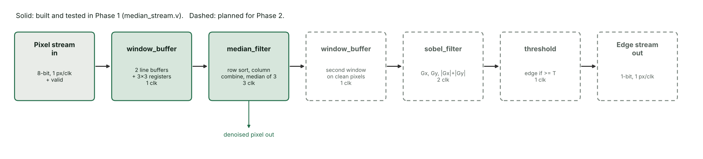
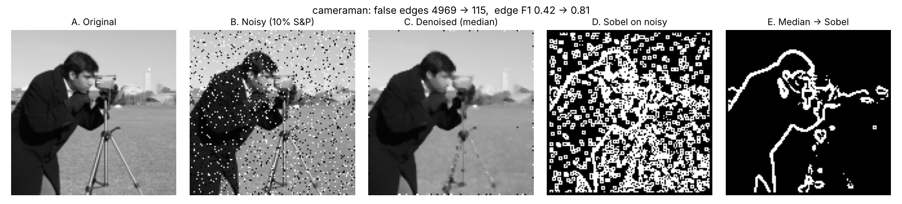
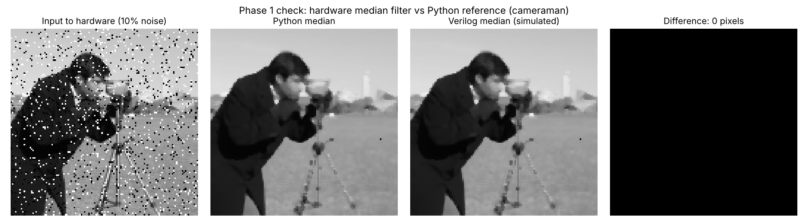

# Pipelined FPGA Image Processing: Median Filter and Sobel Edge Detection

BTech 3rd-year ECE minor project by Naina Sehgal.

A 3×3 median filter removes salt-and-pepper noise from an image, and a Sobel
operator then finds the edges. The algorithm is modelled in Python (the
"golden" reference) and built as streaming, pipelined Verilog hardware for a
Xilinx Artix-7 FPGA. The hardware is checked bit for bit against Python in simulation.



## Project status

| Phase | Scope | Status |
|---|---|---|
| Phase 1 (mid evaluation) | Python reference model, full software experiment, Verilog line buffer and median filter, streaming median hardware with testbenches, interactive interface | Done |
| Phase 2 (final evaluation) | Verilog Sobel and threshold, full median to Sobel pipeline, end-to-end testbench, Vivado synthesis, latency, throughput and resource analysis | Planned |

## Phase 1 results

**Software experiment** (128×128 images, salt-and-pepper noise at 5, 10 and 20 percent):

| Image | Noise | PSNR noisy to denoised | False edges: Sobel only to median then Sobel | Edge F1: Sobel only to median then Sobel |
|---|---|---|---|---|
| cameraman | 10% | 15.2 to 26.3 dB | 4969 to 115 | 0.42 to 0.81 |
| coins | 10% | 15.5 to 27.6 dB | 4684 to 216 | 0.54 to 0.88 |
| shapes | 10% | 15.1 to 33.2 dB | 5231 to 38 | 0.32 to 0.97 |

All 9 cases are in `results/metrics.csv`.



**Hardware** (Icarus Verilog simulation of `rtl/median_stream.v`):

- Median unit test: 2,000 of 2,000 random windows match Python.
- Streaming test on the noisy cameraman image: 15,876 of 15,876 denoised pixels match Python, 0 errors.
- Same test with about 25% random idle clocks in the input: 0 errors.
- Throughput: 1 pixel per clock (16,384 pixels in 16,389 clocks).
- Latency: 4 register stages (window buffer 1, median filter 3).



## Interactive interface

Open `ui/index.html` in any browser. It needs no server or internet connection
(only the web fonts need internet; without them it falls back to system fonts).

- **Try it:** pick a test image or your own, set the noise level and edge threshold,
  and compare edges with and without the median filter, with live metrics.
- **One pixel:** click any pixel to see the 3×3 window, the hardware median steps and the Sobel arithmetic.
- **Clock by clock:** step the Phase 1 hardware one clock at a time and watch the line
  buffers, window registers, pipeline stages and a timing diagram. This simulation
  produces exactly the same output as the Verilog testbench.

## Design choices

| Item | Choice |
|---|---|
| Image size | 128 × 128, 8-bit grayscale |
| Noise | Salt and pepper, 5, 10 and 20 percent, fixed seed 2026 |
| Median | 3×3, exact median by row sort, column combine, median of 3 |
| Sobel | Standard 3×3 kernels, magnitude = \|Gx\| + \|Gy\| |
| Threshold | 200 (edge if magnitude ≥ 200) |
| Border | Only pixels with a full 3×3 window get an output: median output 126×126, edge output 124×124 |
| Target FPGA | Artix-7 xc7a35tcpg236-1 (the Basys3 board's chip) |

## Folder structure

```
python/   dip.py (reference model), run_experiments.py, make_vectors.py,
          compare_rtl.py, draw_architecture.py, make_ui_images.py
rtl/      window_buffer.v, median_filter.v, median_stream.v
tb/       tb_median.v, tb_median_stream.v
sim/      run_sim.sh
ui/       index.html, style.css, app.js, images.js
images/   original, noisy, denoised, edges (PNG)
results/  metrics.csv, plots/, vectors/, simulation logs
```

## How to run

Requirements: Python 3 (`pip install -r requirements.txt`) and Icarus Verilog
(the Windows installer includes GTKWave).

```bash
python python/run_experiments.py    # software experiment and figures
python python/make_vectors.py       # golden test vectors for Verilog
bash sim/run_sim.sh                 # Verilog simulation (Git Bash on Windows)
python python/compare_rtl.py        # hardware vs Python image
gtkwave results/tb_median_stream.vcd
```

Without Git Bash, run the commands inside `sim/run_sim.sh` one by one in the VS Code terminal.

## Limitations

- No physical FPGA board is used; results come from simulation (and, in Phase 2, synthesis estimates).
- Images are read from files, not a live camera.
- Border pixels without a full 3×3 window are not processed.
- One fixed threshold is used for every image.
